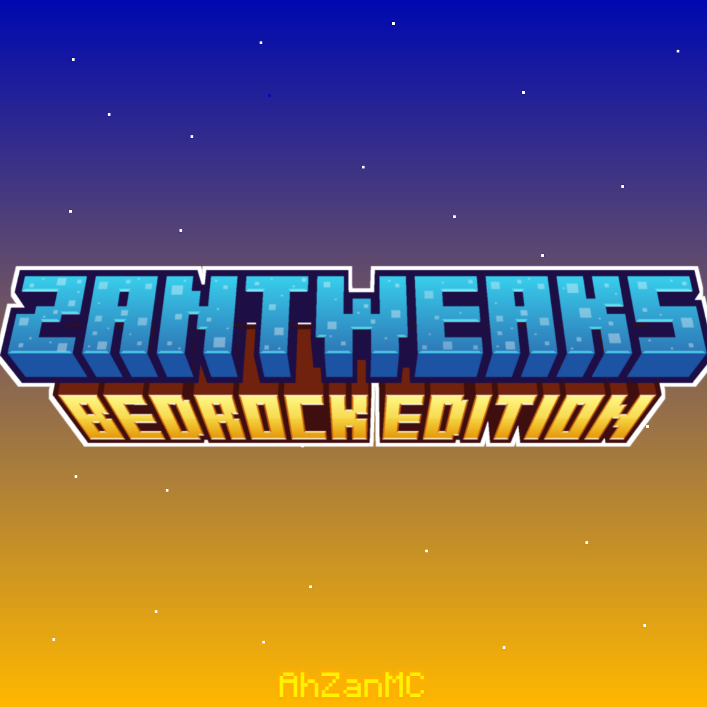

 

 

 
    <a href="https://github.com/AhZanMC/ZanTweaks/releases">Download</a> |
    <a href="https://bio-link.ahzanmc.my.id/">Creator</a> |
    <a href="https://saweria.co/AhZanMC">Support Me</a>

ZanTweaks adalah texture pack aesthetic dan smooth untuk Minecraft Bedrock Edition. Texture ini dirancang untuk memberikan pengalaman visual yang memanjakan mata tetapi ramah untuk device kentang. Texture ini merupakan next gen dari texture pendahulu yaitu FG24 PE Pack, membawa pengalaman visual yang lebih halus dan detail.